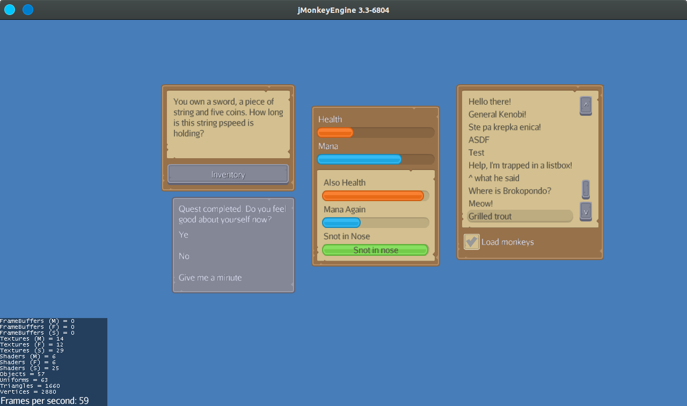

# Lemur medieval theme
Lemur port of the "RPG expansion" UI pack by Kenney (https://www.kenney.nl/assets/ui-pack-rpg-expansion). All the images included in the pack are also included in this repository, so you can make your own UI elements or choose different colors.

Currently supported Lemur elements: Container, Label, Button, Slider, ProgressBar, ListBox and Checkbox. If you add support for some other elements please submit a PR.



# Usage
## Setting up
Clone the repository and make sure that the "themes" folder is located on the root of your classpath. Usually it would be put into the assets directory. If you use gradle, you can put it into the module's resources folder, just like this repository.
## Telling lemur to use this theme
Replace your Lemur init code:
```java
GuiGlobals.initialize(this);
BaseStyles.loadGlassStyle();
GuiGlobals.getInstance().getStyles().setDefaultStyle("glass");
```
with:
```java
GuiGlobals.initialize(this);
BaseStyles.loadStyleResources("themes/medieval/medieval.groovy");
GuiGlobals.getInstance().getStyles().setDefaultStyle("medieval");
```
## Using the desired variation
Some Lemur elements in this theme have different variations. The variation used is chosen by setting the element id to the correct one from the list. For the actual looks refer to the image above.

 - Container
   - when no ID is set, the dark brown variation is used
   - "darkContainer" (the dark gray variation)
   - "insetContainer" (the beige variation without a border)
 - Label
   - when no ID is set, the dark text color is used
   - "lightLabel" (the light text variation)
 - Progress Bar
   - doesn't have a default look, you will have to set one of the following
   - "orangeBar" (an orange progress bar)
   - "blueBar" (a progress bar that is, well, blue)
   - "greenBar (snot in nose type of progress bar)
